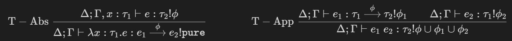

# Twilight Lang
## The 4-Way Equivalence
Language Construct | Theory | Model | Operation | Axiom | Entailment | Introduction | Hierarchy | Access
:----|:----:|:----:|:----:|:----:|:----:|:----:|:----:|:----:|
Model Theory | signature $T$ | $\mathcal{M}$ | operations | equations | $\mathcal{M}\vDash T$ |  | sub-$T$ |
Algebraic Effects | effect signature | handler |  |  |  | `with _ handle _` |  | open just in scope |
First-Class Modules | signature | module | member functions | dependent member functions |  | `import _` | "sub-module" | `M.x` or `open M` |
Dependent Records | `interface` | `struct` | members |  | `implements` | only local scope | subtyping/inheritance/`<:` | `M.x` |
Type Classes | (type) `class` | `instance` | functions | laws | implied from `instance` | global scope |  | always open |
Twilight | `M = [x : T]` | `E = [x = t]` | `x` | `[x : A, y : B(x)]` | `M : E` | `use M; c` | row polymorphism | qualification primitives


## Language Motivation / Overview
Twilight is based on the generalization of three big concepts: effects & handlers, type classes, and first-class modules. From modules we also get the extra bonus of (dependent) records.

The following document incrementally builds up to the entire model system by walking through the different manifestations of it:

### Algebraic Effects
We begin by looking at a simple effect system, which is a slightly modified version of what's actually used in Twilight. The goal of effect systems is to distinguish between pure values, and those that perform computation or invoke side effects.

An *effect signature* is a labeled collection of *operations*, giving each label a type. for example, a `state` effect parameterized over type `T`
```
state (T : Type) = [get : 𝟙 ~> T, set : T ~> 𝟙];
```
Or an effect that allows raising exceptions as operations which never return anything
```
exception = [raise : 𝟙 ~> 𝟘];
```
If an expression uses any of the operations defined by an effect, this information is encoded as part of the type written as `e : t | E` where `e` is an expression, `t` is its type, and `E` is the effect that it uses. (Later we will see this modified to support a more polymorphic handler structure)

Effects also come with *handlers* which give definitions for the effect's operations. The `state` effect may be handled with the handler
```
handler_state s = [
    return x = (x, s)
    get      = resume (x, s)
    set s    = resume (s, ⋆)
];
```
> Notation: to avoid confusion this example uses `(,)` notation for tuples, though in the future I'll probably use `[,]` for both tuples and named tuples (ie records (ie modules (ie effect handlers)))

> Notation: we also use `⋆` to denote the unique element of `𝟙`, while `𝟘` stands for the uninhabited type.

This handler uses two special keywords:
- `return` is a special operation which represents returning a pure value from a computation.
- `resume` is a continuation back to the calling code. it is used explicitly, which means a handler may resume multiple times (*multi-shot*), just one time (*one-shot*) as here, or not at all (*zero-shot*).

To get a pure value out of an effectful computation, we must handle all the effects that arise from it (kept track of in the type). We do this with the `with _ handle _` construct, which takes a handler and a computation. This so called computation may look like:
```
post_increment (_ : 𝟙) : int | state int =
    curr = get ⋆;
    set (curr + 1);
    curr
```
> Notation: the `;`-block notation may change significantly in the future, this example is just to convey the idea of *sequential computations*.

here we see a function which takes unit and returns an int, but also has the side effect of incrementing a `state int`, which is encoded in the function's type with the `| state int`. (This is in fact a *latent* effect, but we'll not get into that right now)

This function is still impure, so we need to use some handler to eliminate the effect from the type:
```
with (handler_state 5) handle
    n = post_increment;
    _ = post_increment;
    return n;
```
This expression initializes the internal state to `5`, then increments it twice, but keeps the original value to return at the end. The stateful effects are handled with the `handler_state` defined previously.

Quick reminder that this is effect system is just for demonstration purposes, and not the actual system used in Twilight. Before looking at the real effect system, let's look at a completely separate concept.

### Type Classes
*Type classes* introduce a set of functions into the global scope, parameterized over types. This allows generic functions to have different definitions for different parameter types ("ad-hoc polymorphism"). A type class only provides the signatures for its functions, for example:
```
group (T : Type) = [mult : T -> T -> T, inv : T -> T]
```
> Notation: defining type classes looks pretty similar to defining effect signatures... what a coincidence!

With the help of dependent types and the curry-howard correspondence, we can get a little more mathematical
```
group (T : Type) = [
    mult : T -> T -> T
    inv : T -> T

    assoc : (a b c : T) -> mult (mult a b) c == mult a (mult b c)
    ... more group axioms
]
```
> Notation: sometimes it's cleaner to use line breaks instead of `;`s. I'm still not sure how I feel about it, how it will be to parse, or how it interferes with other parts of the language.

We'll stick with the simpler signature for now and come back to this one later. Now that we have a type class, we can define *instances*, for example how the reals are a group wrt addition:
```
instance group real = [
    mult p q = p + q
    inv r = -r
]
```
> Notation: the `instance` keyword is used for saying that the functions defined under it are actually the implementations of those from the signature of `group`.

We can now use this instance in our generic code. First define a generic function taking some parameter `x` of type `T` which multiplies it with itself four times, while making sure `T` is an instance of `group`
```
four_times (x : T) | group T = mult x (mult x (mult x x))
```
> Notation: hey, overlapping syntax again! The same restriction `| E` appeared for effects. A connection between the two might be getting more and more obvious, we will unify the two concepts soon.

And we can use the function we defined on real parameters. `four_times 3.0` results in `12.0`, while `four_times 'H'` gives a type error since we didn't define a `group` instance for characters!

Here's another interesting instance for `group`:
```
instance group real = [
    mult p q = p * q
    inv r = 1/r
]
```
This instance implements the same `group real` but with different definitions. Mathematically speaking, both of these are equally valid. So which one should we choose?

### Introducing: Scoped Type Classes
Answer: both! Here's a slight change in syntax which allows us to give a name for every instance of a type class
```
additive-real : group real = [
    mult p q = p + q
    inv r = -r
]

multiplicative-real : group real = [
    mult p q = p * q
    inv r = 1/r
]
```
But now we have a problem - how do we choose which of the instances to use when we see a `mult 3.0 3.0`? Let's introduce a new syntax construct `use _ in _` which is used like so
```
four_times (x : T) | group T = mult x (mult x (mult x x))

twelve     = use additive-real       in (four_times 3.0)
eighty_one = use multiplicative-real in (four_times 3.0)
```
How about using both at the same time? For this we will use `rename` sytnax, like so:
```
quadratic (a b c : real) = lam (x : real) .
    use additive-real rename [plus = mult, neg = inv];
    use multiplicative-real renaming [mult = mult, recip = inv];
    plus (mult a (mult x x)) (plus (mult b x) c)
    -- same as 'a*x*x + b*x + c'
```

### Type Classes + Control Flow = Effects & Handlers
The similarities between type classes and effects are hopefully somewhat apparent at this point. Let's now introduce some new constructs to bridge over the differences. The most obvious difference is in the use of two sepcial keywords in effect definitions: `return` and `resume`. Type classes don't have anything that corresponds to `return`, since they always `resume` to the caller. Moreover they always `resume` exactly once (as do all pure functions) (see *tail resumptive operations* in Koka docs). To overcome these, I decided to introduce new general control flow structures.

- `return`: is a special function that can be defined in any model (*model* would be the general name we use for type classes, handlers, and modules later on). Wherever the model defining this `return` is `use`d, is where the `return` jumps to when it's called. A bit more concretely: if we use some model `M = [return = e, ...]` with `use M; c`, and then somewhere in `c` something calls `return`, the entire `use` expression will evaluate to `e` (the full system has an extra special function `finally` which alters this behavior slightly). This is very similar to C-style return.

- `resume`: is a function that can be used within any function defined in a model. `resume` stands for the current continuation of the location where the function is called, so intuitively it's like an implicit parameter passed to the function from the call site. For example, when we write the sequential code `b = f a; g`, calling `resume` within the definition of `f` will be like calling `g`.

- Note, in traditional effect handlers the operation typically returns to the point of `use`, not to the caller, and if they want to return a result to the caller they use `resume` (Koka even has special syntax sugar for tail-resumption which I find ugly and want to avoid at all cost). Now this is not the case anymore. Functions return to the caller by default, and `return` is the uniform mechanism for escaping back to the handler.

- `finally`: is a QoL construct that appears in many existing algebraic effect systems. It allows having an internal representation for the effect's data while exposing a transformed version of it. When a model is applied using `use M; c`, and evaluates (either through c or through a return) to some type `T`, the function `finally : T -> S` will be applied on it to produce the final value of the entire `use` expression.

- example: state

### Type-and-Effect Systems
- tracking effects in types
- tracking class instances in types

### Records
- collections of labels

### Modules are Records
- importing
- opening
- qualifying
- renaming
- exposing

### Sub-Modules and Row Polymorphism

### Type Classes are Records

### Modules are Handlers
- ex: introducing a memory allocator as a library
- challenges with transferring control flow to a library

### Sub-Classes are Forgetful Functors

### Bonus: Expressing ADTs with Records
dependent records
- `[a : T, b : S]` is the type of `[a = t, b = s]`
- untagged tuples?
- list literals?
variants
- `{a : T, b : S}` is the type of `{a = t}` and `{b = s}`
- better syntax?

- abstract syntax tree
```
ast = {
    numlit : int
    boollit : bool
    binop : [o : op, lhs : ast, rhs : ast]
    cond : [c : ast, tb : ast, fb : ast]
}
```
- pattern matching
```
match my_ast on
    numlit n = ...
    boollit b = ...
    binop [o = my_o, lhs = my_lhs, rhs = my_rhs] = ...
    cond [c = my_c, tb = my_tb, fb = my_fb] = ...
```


## Examples
- exceptions
```
error {A : Type} = [throw : 𝟙 -> A]
default_err (a : A) : error int = [throw ⋆ = a]

div (n m : int) : int | error {int} =
    if m == 0 then throw ⋆ else n / m

main : 𝟙 -> 𝟙 | io =
    use (default_err 100);
    print (div 6 3); -- 2
    print (div 5 0); -- 100
    return ⋆;
```

- same but inlined
```
div (n m : int) : int | [throw : 𝟙 -> int] =
    if m == 0 then throw ⋆ else n / m

main (_ : 𝟙) : 𝟙 | io =
    use [throw ⋆ = 100];
    print (div 6 3); -- 2
    print (div 5 0); -- 100
    return ⋆;
```

- errors as maybes
```
error {A : Type} = [throw : 𝟙 -> A]
maybe_err : error (maybe int) = [
    throw ⋆ = return none
    return x = return (some x)
]
```

- nondeterminism
```
nondet = [
    fail : 𝟙 -> 𝟙
    flip : 𝟙 -> bool
]

handle_nondet = [
    return x = x :: nil
    fail ⋆   = return nil
    flip ⋆   = return (resume true ++ resume false)
]

quantum : int | nondet = if flip ⋆ then 4 else 5
main (_ : 𝟙) : 𝟙 | io =
    use handle_nondet;
    print quantum; -- 4 :: 5 :: nil
    return ⋆;
```

- reader
```
reader (a : Type) = [ask : a]
const_reader {a : Type} (x : a) : reader a = [ask = resume x]

add_twice : int | reader int = ask + ask
const_twice : int = use (const_reader 21); add_twice
```
challenge: implemet `rand_reader` which propagates an RNG effect. how can a handler rely on another outer effect?


# Relevant Literature
## Effects
- [Type and Effect Systems](https://www.ccs.neu.edu/home/amal/course/7480-s12/effects-notes.pdf) gentle introduction, only about effects without handlers

- [Handling Algebraic Effects](https://homepages.inf.ed.ac.uk/gdp/publications/handling-algebraic-effects.pdf) Gordon & Plotkin thesis, VERY DETAILED
- [Algebraic Effects for Functional Programming](https://www.microsoft.com/en-us/research/wp-content/uploads/2016/08/algeff-tr-2016-v3.pdf)
    - overview of common usecases
    - typing rules & inference
    - compilation via type-directed CPS transformations
- [Efficient Compilation of Algebraic Effect Handlers](https://dl.acm.org/doi/pdf/10.1145/3485479) describes mostly core-to-core optimization transformations

- [What's Algebraic About Algebraic Effects and Handlers?](https://youtu.be/atYp386EGo8) video lecture, theory-focused (formal semantics)
    - [Corresponding lecture notes](https://github.com/OPLSS/introduction-to-algebraic-effects-and-handlers)
    - backing literature
        - [An Introduction to Algebraic Effects and Handlers](https://www.eff-lang.org/handlers-tutorial.pdf)
        - [An Effect System for Algebraic Effects and Handlers](https://arxiv.org/pdf/1306.6316.pdf)
    - [Handlers of Algebraic Effects](https://homepages.inf.ed.ac.uk/gdp/publications/Effect_Handlers.pdf) related paper

- [Handlers in Action](https://homepages.inf.ed.ac.uk/slindley/papers/handlers.pdf) algeffects implemented in haskell

- [Exceptional Syntax](https://www.cs.tufts.edu/~nr/cs257/archive/nick-benton/exceptional-syntax.pdf) semantics of exception handlers
- [Effect Handlers in Scope](https://www.cs.ox.ac.uk/people/nicolas.wu/papers/Scope.pdf)

### Builtin Effects
- `[]` (neutral element in the semilattice of effects)
- `io.read`, `io.write`
- `chaos` (equivalent to `top` for types)
### Builtin Handlers
- `stdio : a | io`
- [IO Inside](https://wiki.haskell.org/IO_inside#Running_with_the_RealWorld) how Haskell's IO monad is implemented.

### Inference
- [A Generic Type-and-Effect System](http://web.cs.ucla.edu/~todd/research/tldi09.pdf) thorough formalization of effects as prigileges
- arrow types, latent effects
    
- [Type Directed Compilation of Row-typed Algebraic Effects](https://www.microsoft.com/en-us/research/wp-content/uploads/2016/08/algeff-tr-2016-1.pdf)
- [Effect Handlers, Evidently](https://dl.acm.org/doi/pdf/10.1145/3408981) efficient compilation using evidence passing
- [First-class Handler Names](https://xnning.github.io/papers/hope21.pdf)

## Type Classes
- [Implementing, and Understanding Type Classes](https://okmij.org/ftp/Computation/typeclass.html) online webpage, general survey w/ Haskell and OCaml examples
- [Implementing Type Classes](https://citeseerx.ist.psu.edu/viewdoc/download?doi=10.1.1.127.8206&rep=rep1&type=pdf) seems approachable

- [First-Class Type Classes](https://sozeau.gitlabpages.inria.fr/www/research/publications/First-Class_Type_Classes.pdf) practical formalization of first-class type classes expressed as linearly-dependent record types.

## Modules
### Width & Depth Subtyping
### First-Class Modules
- [Modules Matter Most](http://macqueenfest.cs.uchicago.edu/slides/harper.pdf) slides, relates to typeclasses
### Dependent Record Types
- [Dependent Record Types Revisited](https://citeseerx.ist.psu.edu/viewdoc/download?doi=10.1.1.156.3187&rep=rep1&type=pdf#:~:text=A%20dependent%20record%20type%20is,type%20V%20ect(2)) rather simple formalization and application. briefly talks about structural subtyping and relation to sigma-types.
- [Typed Operational Semantics for Dependent Record Types](https://www.cs.rhul.ac.uk/~zhaohui/TYPES09.pdf) more thorough formalization of the system described in the previous paper, including proofs of many important properties.

## Subtyping
- [The Simple Essence of Algebraic Subtyping](https://dl.acm.org/doi/pdf/10.1145/3409006) SimpleSub paper
- [Type Inference with Structural Subtyping: A Faithful Formalization of an Efficient Constraint Solver](http://cristal.inria.fr/~simonet/publis/simonet-aplas03.pdf)
- [Subtyping Dependent Types](https://reader.elsevier.com/reader/sd/pii/S0304397500001754?token=615563B5B022E7BC6FA3AABE6AA5922F690CB8F4CCBBABB731F4E568F8B772820FE38F7EDD19C9D94F6750782CADE890&originRegion=eu-west-1&originCreation=20220731225919)

## Inductive Types
- [Foundation of Inductive Types](https://www.labri.fr/perso/casteran/CoqArt/chapter14.pdf)

## Dependent Types
### Dependent Elimination (Pattern Matching)
- [Elaborating dependent (co)pattern matching](https://www.cse.chalmers.se/~abela/icfp18.pdf) co-authored by Abel. considers dep types.
- [Focusing on Pattern Matching](https://citeseerx.ist.psu.edu/viewdoc/download?doi=10.1.1.86.2805&rep=rep1&type=pdf) considers relation to curry-howard. very formal. has sections on coverage checking & compilation.
- [Dependently Typed Pattern Matching](http://ats-lang.sourceforge.net/PAPER/DTPM-jucs03.pdf) looks like it has more explanations, appeals to intuition. still also has some formal descriptions.
- [Pattern Matching with Dependent Types](https://wonks.github.io/type-theory-reading-group/papers/proc92-coquand.pdf) uses coverings, not a lot of detail. seems a little outdated. authored by Coquand.

## Self Hosting
- [The Implementation of Functional Programming Languages](https://www.microsoft.com/en-us/research/uploads/prod/1987/01/slpj-book-1987.pdf) Simon L. Peyton Jones
    - semantics of functional languages
    - compilation of pattern matching
    - type checking
    - advanced graph reductions
    - optimizing general tail calls
- [Verified Optimizations for Functional Languages](https://zoep.github.io/thesis_final.pdf) $\lambda_{ANF}$ thesis
- [Tail Recursion Modulo Cons](https://arxiv.org/pdf/2102.09823.pdf)
### LLVM
- Native Executable
- [LLVM's GCC Backend](https://llvm.org/pubs/2010-09-HASKELLSYM-LLVM-GHC.pdf)
- WASM?
### Minimal Implementation
- record types w/ subtyping
- non-dependent ADTs
- IO effects